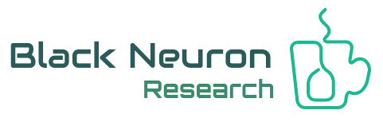

Black Neuron Research is a non for profit club for Ruby on Rails enthusiasts created to help young students learn Ruby on Rails. We are geographicaly based in Aguascalientes, México

* Ruby version: 2.4.1p111 (2017-03-22 revision 58053) [x86_64-linux]

* Rails version: 5.1.4

* System dependencies
    * Pry (0.11.3 on Ruby 2.4.1)
    * Byebug
    * Guard
    * Mini test reporters
    * Puma app server
    * heroku-cli/6.15.13 (linux-x64) node-v9.4.0

## Getting started

To get started with the app, clone the repo and then install the needed gems:

    $ bundle install --without production

Next, migrate the database:

    $ rails db:migrate

Finally, run the test suite to verify that everything is working correctly:

    $ rails test

If the test suite passes, you'll be ready to run the app in a local server:

    $ rails server

## License

All source code is available jointly under the MIT License and the Beerware License. See
[LICENSE.md](LICENSE.md) for details.

There's also one addemdum to the license: Please help us be better developpers, comment and participate with suggestions, any feedback is welcome (not trolling please).